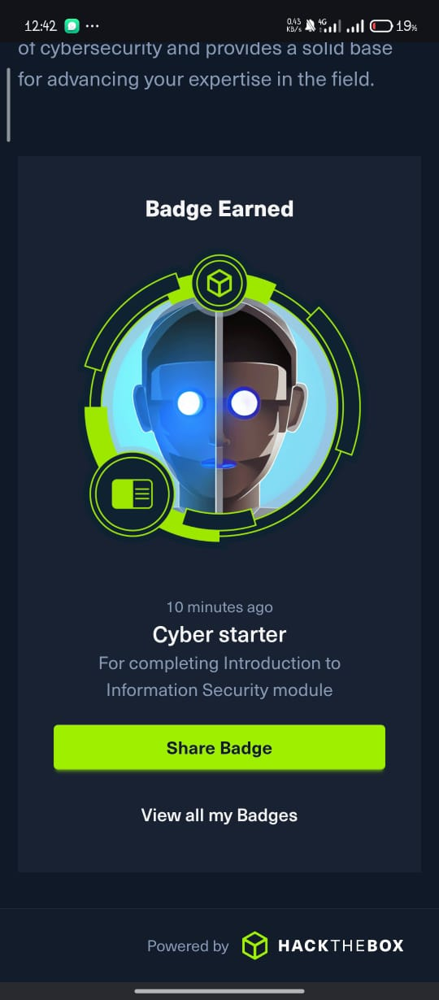
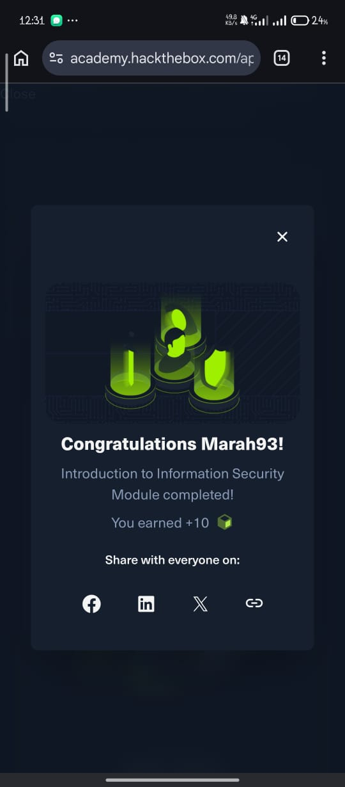

# Introduction to Information Security
## Overview
The **Introduction to Information Security** module provided a foundation in cybersecurity by introducing the principles of protecting information and information systems. It covered the importance of maintaining confidentiality, integrity, and availability while explaining how organizations defend against cyber threats.

## Topics Covered
- Information Security Fundamentals
- The CIA Triad (Confidentiality, Integrity, Availability)
- Common Cybersecurity Threats
- Threat Actors
- Disaster Recovery (DR)
- Business Continuity (BC)
- Information Security Domains
- Cybersecurity Teams and Roles
## Hands-on Labs Completed
- Introduction to Information Security practical exercises
- Knowledge check activities
## Skills Gained
- Explain the core principles of information security.
- Understand the CIA Triad and its role in protecting information.
- Identify common cyber threats and threat actors.
- Describe the purpose of disaster recovery and business continuity.
- Recognize the responsibilities of different cybersecurity teams.
## Platform
Hack The Box Academy
## Learning Path
Junior Cybersecurity Analyst
## Status
✅ Completed (June 2026)
## Achievement
### Module Badge

### Module Completion

## Disclaimer
This document contains my own learning notes and summary. It does not include Hack The Box Academy solutions, flags or proprietary content.
